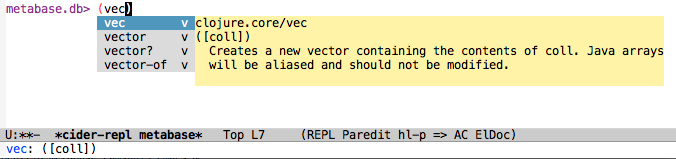

Barebones Emacs setup for using [CIDER](https://github.com/clojure-emacs/cider) REPL with the essentials like `paredit` and `auto-complete`.



#### Install Emacs

```shell
brew install emacs --with-cocoa
```

#### Put this in your `~/.emacs.d` directory:

```shell
git clone https://github.com/camsaul/minimal-emacs-clojure-repl-setup.git ~/.emacs.d
```

#### Launch the CIDER REPL:

```shell
cd my-clojure-project
emacs -cider &
```

Now wait a minute for the REPL to start and that's it!
